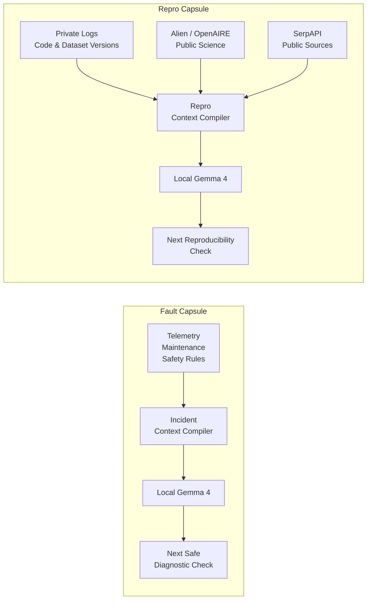

# Idea List

## 1. Fault Capsule

A local-first incident context compiler that turns noisy telemetry, maintenance history, asset topology, and safety rules into a compact evidence capsule, enabling Gemma 4 to choose the next safe diagnostic check.

## 2. Repro Capsule

A privacy-first research assistant that combines private experiment logs with sourced public science, enabling local Gemma 4 to identify the next reproducibility check without exposing sensitive or unpublished data.

